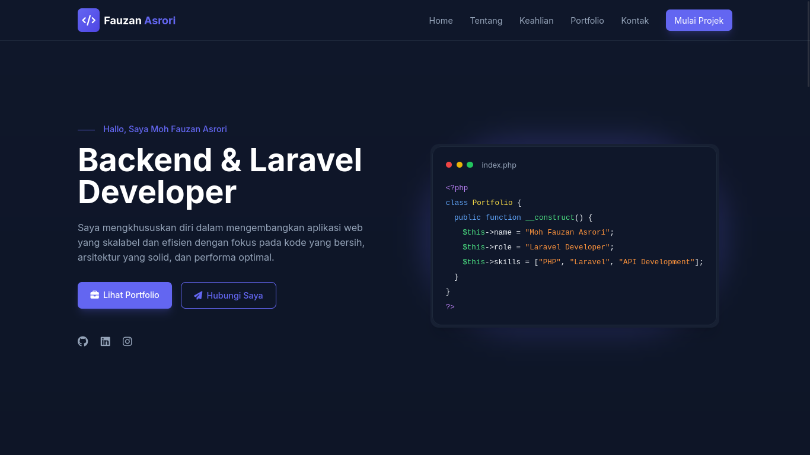

# Portfolio Website - Moh Fauzan Asrori


Portfolio website profesional untuk **Moh Fauzan Asrori**, seorang **Laravel & Backend Developer**, dengan desain dark theme yang elegan dan modern.

## 📷 Screenshot



## ✨ Fitur Utama

- **Desain Profesional** - Tema dark dengan aksen ungu yang elegan
- **Responsif** - Tampilan optimal di semua perangkat (desktop, tablet, mobile)
- **Performa Tinggi** - Load cepat dan pengalaman pengguna yang smooth
- **SEO Friendly** - Struktur HTML yang optimal untuk mesin pencari
- **Form Kontak** - Sistem kontak yang terintegrasi
- **Navigasi Intuitif** - Menu navigasi yang mudah digunakan

## 🛠️ Teknologi yang Digunakan

- **HTML5** - Struktur semantik modern
- **Tailwind CSS** - Framework CSS utility-first
- **Font Awesome 6** - Library icon premium
- **Google Fonts (Inter)** - Font utama website
- **JavaScript ES6+** - Interaktivitas dan animasi
- **CSS3** - Animasi dan efek visual tambahan

## 🚀 Cara Menjalankan

1. **Clone repository**:

   ```bash
   git clone https://github.com/BitwiseJs/portfolio-website.git
   ```

2. **Masuk ke direktori project**:

   ```bash
   cd portfolio-website
   ```

3. **Buka di browser**:
   - Buka file `index.html` langsung di browser web
   - Atau gunakan live server extension di VS Code

## 🎨 Skema Warna

| Warna        | Kode                   | Penggunaan           |
| ------------ | ---------------------- | -------------------- |
| Primary Dark | `#0F172A` to `#0A0F1C` | Background gradient  |
| Card Dark    | `#1E293B`              | Kartu dan komponen   |
| Accent       | `#6366F1`              | Tombol dan highlight |
| Accent Light | `#818CF8`              | Hover state          |
| Text Light   | `#F1F5F9`              | Teks utama           |
| Text Dark    | `#94A3B8`              | Teks sekunder        |

## 📱 Sections

1. **🏠 Home** - Introduksi dan hero section
2. **👨‍💻 Tentang** - Latar belakang dan nilai inti
3. **🛠️ Keahlian** - Teknologi dan tools yang dikuasai
4. **📂 Portfolio** - Project-project terpilih
5. **📞 Kontak** - Form dan informasi kontak

## 🔧 Customization

Untuk mengkustomisasi website:

1. **Ubah informasi pribadi** di section HTML yang sesuai
2. **Edit warna** melalui custom properties pada directory `css/style.css`
3. **Tambah project** di portfolio section
4. **Update social links** di footer dan contact section

## 📞 Kontak

- **Email**: mohfauzanasrori@gmail.com
- **LinkedIn**: [Moh Fauzan Asrori](https://www.linkedin.com/in/moh-fauzan-asrori/)
- **GitHub**: [BitwiseJs](https://github.com/BitwiseJs)
- **Instagram**: [@mohfauzanasrori](https://instagram.com/mohfauzanasrori)

## 🤝 Berkontribusi

Contribusi, issues, dan feature requests dipersilakan! Feel free to check [issues page](https://github.com/sukmaajidigital/portfolio-website/issues).
